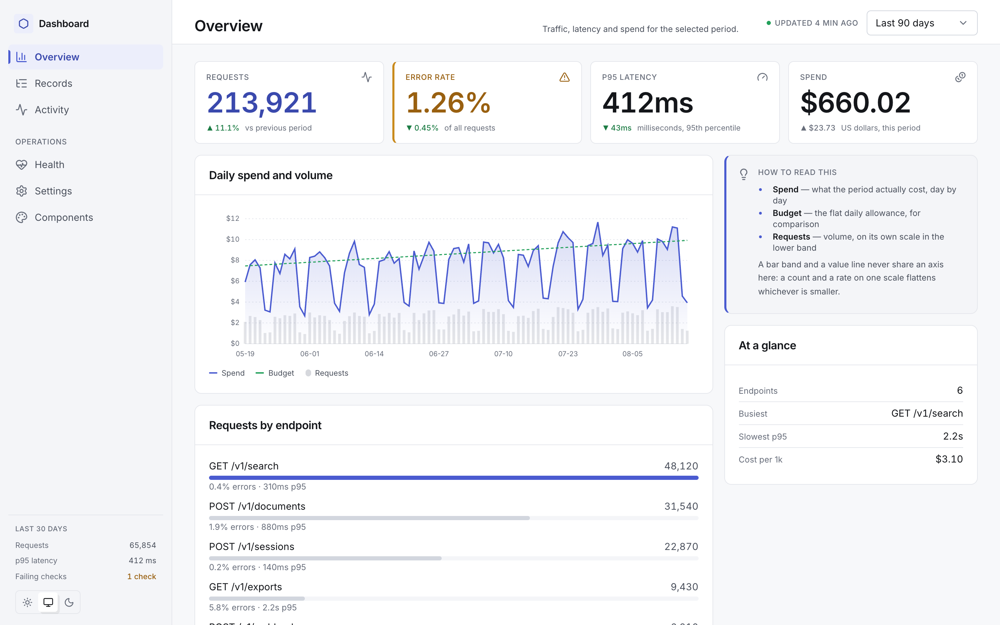
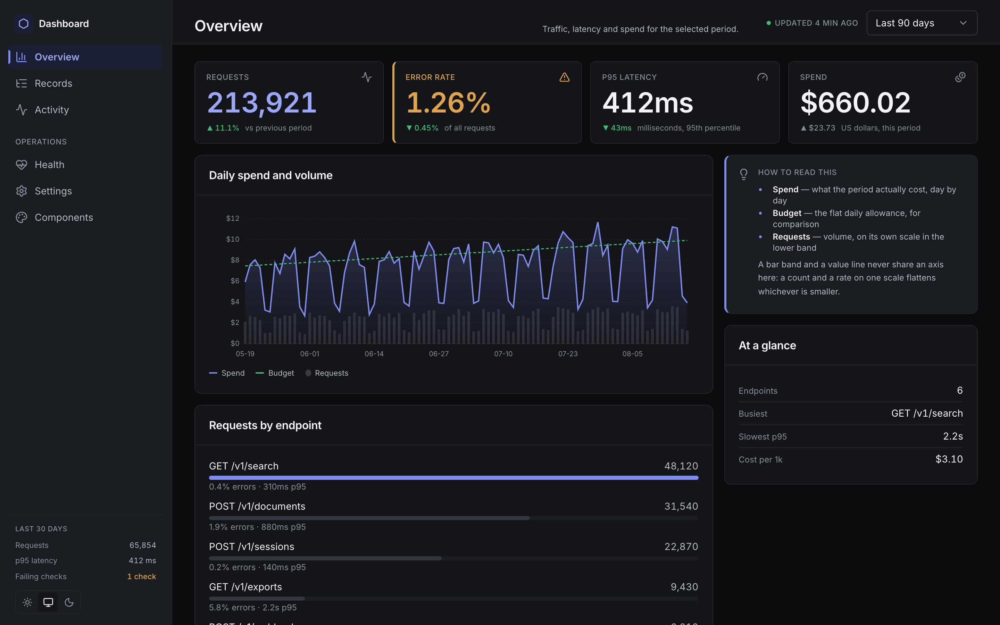
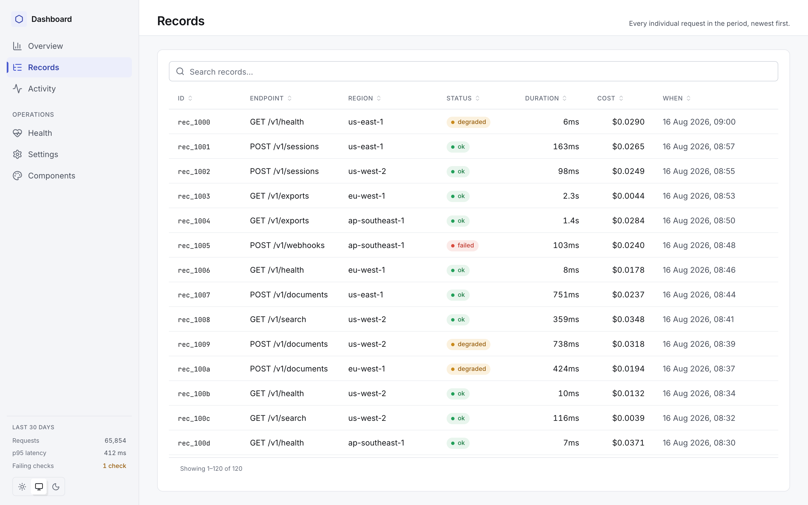
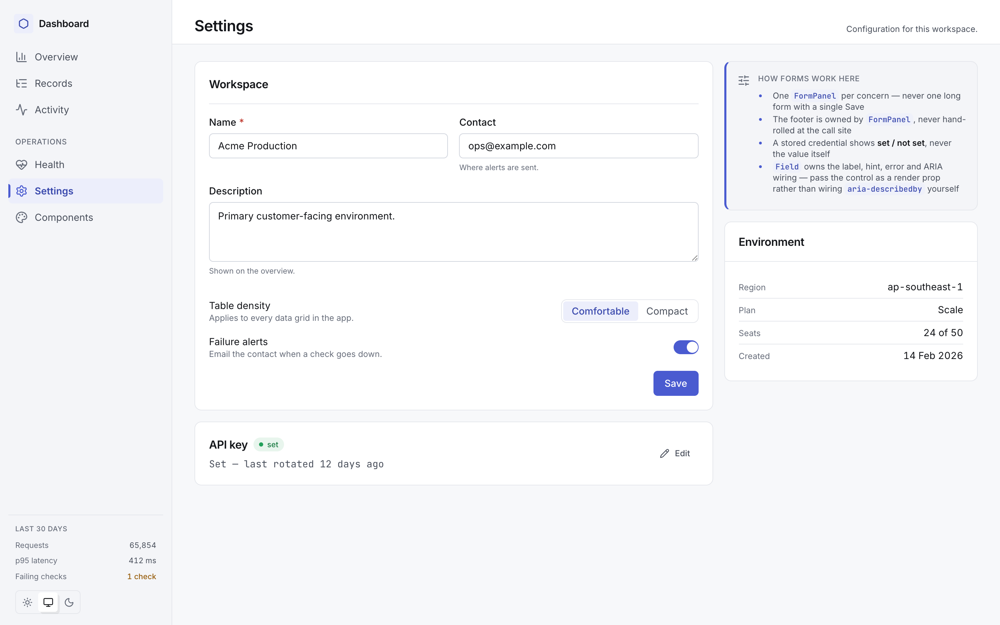
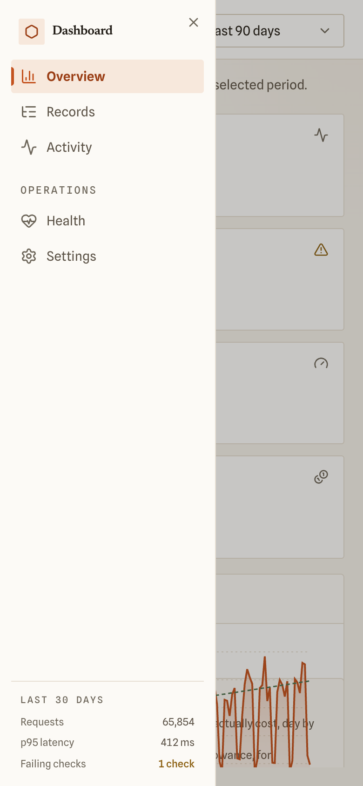

# multi-model-agent-dashboard-template

A dashboard starter: Next.js 16 · React 19 · Tailwind v4 · TypeScript, carrying
a complete design system — a neutral token set with light and dark themes, 38 UI
primitives, layout patterns, four dependency-free charts, a component gallery,
and two browser-driven audits.

**It runs with no backend.** Clone, install, `pnpm dev`, and you get five
working pages against a seeded fake dataset.

```bash
pnpm install
pnpm dev            # → http://localhost:3000
```





---

## What you get

| | |
|---|---|
| **Tokens** | one cool-neutral ramp, one accent, three reserved status hues, a semantic layer over them. **Light and dark shipped together.** Rebrand by repointing `--accent`. |
| **UI kit** | `Button` `Card` `Field` `Input` `Select` `Switch` `Checkbox` `Segmented` `Table` `DataTable` `Badge` `Banner` `EmptyState` `Avatar` `MetricCard` `Tooltip` `DropdownMenu` `Breadcrumb` `Toolbar` … |
| **Patterns** | `StatusDashboard` (the 2/3·1/3 split), `PageShell`, `FormPanel`, `List`, `RecordList`, `RailNote`, `ProseBlock` |
| **Charts** | `TrendChart` `BarList` `CompositionBar` `ActivityHeatmap` — hand-drawn SVG, no charting library, palette read from CSS variables |
| **Shell** | `AppShell` + `PageFrame`: a locked frame where the document never scrolls and exactly one region does |
| **Layout audit** | a real browser asserting ten structural invariants across three viewports |
| **Design audit** | a second browser pass that counts type sizes, radii, shadows, off-scale spacing and contrast failures — craft, measured |
| **Trust signals** | a `Freshness` stamp (with a staleness contract) and one skeleton vocabulary wired to route-level `loading.tsx` |
| **Gallery** | `/components` — every primitive on one page, in the current theme, so they can be judged *together* rather than one at a time |

## The five pages

Each one is a **preset worth copying**, not filler:

| Route | Shows |
|---|---|
| `/` | metric row · trend chart · ranked bars · composition — the standard dashboard |
| `/records` | full-height sortable, filterable `DataTable` — the wide-table preset (no rail) |
| `/activity` | heatmap + derived breakdown — the two-chart preset |
| `/health` | status list, banner, empty state — the operational preset |
| `/settings` | `FormPanel` in both modes: an always-open form and a credential disclosure with live validation |
| `/components` | the design-system gallery — typography, surfaces, controls, form, status, table, empty and loading states |





Every page works down to 390px: below `lg` the rail becomes an overlay drawer
holding the *same* nav node — closing on Escape, on backdrop press and on
navigation, and returning focus to its trigger. The layout audit drives a phone
and a tablet viewport alongside the desktop ones, because a rail that is 232px
wide at every width leaves 158px of content on a phone and every desktop-only
check passes anyway.



## Make it yours

1. **`src/nav.ts`** — the whole primary navigation and `APP_NAME`. Adding a page
   is a route file plus a line here; `Sidebar` holds no route knowledge.
2. **`src/components/AppMark.tsx`** — swap the icon for your logo.
3. **`app/globals.css`** — repoint `--accent` / `--bg` / `--surface` to rebrand.
4. **`src/lib/format-date.ts`** — set `DISPLAY_TIMEZONE`.
5. **`src/data/demo.ts`** — **delete it** and put your queries behind the same
   seam. It is the only data source the pages import.
6. **`app/(dash)/layout.tsx`** — add your auth gate here (read the session,
   `redirect` before the shell renders).

## Commands

```bash
pnpm dev            # dev server
pnpm build          # production build
pnpm test           # vitest
pnpm typecheck      # tsc --noEmit
pnpm lint           # eslint

pnpm add -D puppeteer                                   # once
AUDIT_BASE=http://127.0.0.1:3000 pnpm audit:layout      # with dev running
AUDIT_BASE=http://127.0.0.1:3000 AUDIT_THEME=light pnpm audit:design
AUDIT_BASE=http://127.0.0.1:3000 AUDIT_THEME=dark  pnpm audit:design
```

Puppeteer is deliberately **not** a devDependency — it downloads a ~150MB
browser, which is a lot to impose on everyone who clones a template.

## The visual system is measured, not asserted

`pnpm audit:design` drives a browser over every page and counts the things that
make a UI look unsystematised. The layout audit asks *is it broken?*; this asks
*is it disciplined?* — a page can pass every structural invariant and still look
amateur because it uses ten font sizes, two shadow recipes and seven radii.

| | before | now |
|---|---:|---:|
| WCAG AA contrast failures, light | 60 | **0** |
| WCAG AA contrast failures, dark | — | **0** |
| Distinct type sizes | 10 | **8** (a named scale) |
| Distinct weights | 3 | **3** |
| In-page shadow recipes | 2 | **0** (hairlines and space instead) |
| Off-scale spacings | 1 | **0** |
| Hierarchy ratio, analytical pages | 1.33–2.33× | **3.6–4×** |

Those sixty contrast failures were a single token — the colour of every eyebrow,
caption, table meta and axis label, sitting between 2.77:1 and 3.45:1 depending
on what was behind it. Nobody catches that by looking, because it always looks
fine on the one background you happened to check.

The rules behind each number are in
[docs/DESIGN-SYSTEM.md](docs/DESIGN-SYSTEM.md), and the ones that are cheap to
re-break — one accent per row, the neutral chart population, axis ticks without
cents — are asserted in `tests/design-discipline.test.tsx`.

## Two traps worth knowing before you hit them

**The `.gitignore` is load-bearing.** Its first line is `!*`. Tailwind v4's
scanner walks *up* the directory tree collecting `.gitignore` files and honours
them, so a parent directory that ignores `*` makes every file here invisible to
it: the build emits the theme, the base layer and the hand-written classes but
**zero utilities**. Every page renders as one unstyled column while still
looking, at a glance, like the CSS loaded — fonts and colours are fine, only
layout is gone. `app/globals.css` also names its `@source` paths as a second
belt. Keep both.

**A colour must be mapped to be usable.** A Tailwind class whose colour is not
listed in the `@theme inline` block emits no CSS at all, and the element simply
keeps its inherited colour. Adding a raw CSS variable is half the job.

## Read next

**[docs/DESIGN-SYSTEM.md](docs/DESIGN-SYSTEM.md)** — the tokens, the layout
contract (including the four props that render fine and look wrong when set
incorrectly), the full component catalogue, and the conventions.

## Provenance

Extracted from two production apps built on this system. The UI kit comes from
the richer of the two; `shell.tsx`, `status-dashboard.tsx` and `globals.css`
come from the other, which carries later layout fixes and no app-specific
coupling. Domain components — stage rails, audit findings, SDLC navigators —
were deliberately left behind.

The visual register — near-square geometry, hard offsets instead of blurs, mono
uppercase labels, the accent-rail callout, one signal colour per view, the
head/stage/foot page zones, and the neutral-population-plus-one-highlight chart
palette — is inherited from the same house design language as our presentation
system, so a deck and a dashboard read as one product rather than two.

MIT.
